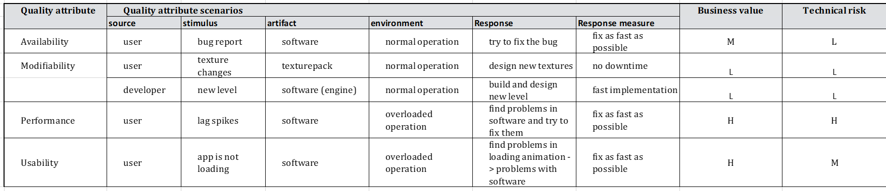

# Software Architecture Document

# Table of Contents
- [Introduction](#1-introduction)
    - [Purpose](#11-purpose)
    - [Scope](#12-scope)
    - [Definitions, Acronyms and Abbreviations](#13-definitions-acronyms-and-abbreviations)
    - [References](#14-references)
    - [Overview](#15-overview)
- [Architectural Representation](#2-architectural-representation)
- [Architectural Goals and Constraints](#3-architectural-goals-and-constraints)
- [Use-Case View](#4-use-case-view)
    - [Use-Case Realizations](#41-use-case-realizations)
- [Logical View](#5-logical-view)
    - [Overview](#51-overview)
    - [Architecturally Significant Design Packages](#52-architecturally-significant-design-packages)
- [Process View](#6-process-view)
- [Deployment View](#7-deployment-view)
- [Implementation View](#8-implementation-view)
    - [Overview](#81-overview)
    - [Layers](#82-layers)
- [Data View](#9-data-view)
- [Size and Performance](#10-size-and-performance)
- [Quality](#11-quality)

## 1. Introduction

### 1.1 Purpose
This document provides an overview of our software architecture. With several different architectural views it depicts different aspects of the system. It is intended to capture and convey the significant architectural decisions which have been made for the system.

### 1.2 Scope
This document describes the architecture of the UltimateRecipeHunter project.

### 1.3 Definitions, Acronyms and Abbreviations

| Abbrevation | Description                            |
| ----------- | -------------------------------------- |
| API         | Application programming interface      |
| MVC         | Model view controller                  |
| REST        | Representational state transfer        |
| SDK         | Software development kit               |
| SRS         | Software requirements specification    |
| UC          | Use case                               |
| VCS         | Version control system                 |
| n/a         | not applicable                         |
| tbd         | to be determined                       |

### 1.4 References

| Title                                                              		| Date       | Publishing organization   |
| --------------------------------------------------------------------------|:----------:| ------------------------- |
| [Repository on GitHub](https://github.com/Raos2806/UltimateRecipeHunter)		| 06.12.2022 | UltimateRecipeHunter Team     |
| [UC1 Play the game](./use_cases/UC1_play_the_game.md)           		| 06.12.2022 | UltimateRecipeHunter Team     |
| [UC2 Safe the game](./use_cases/UC2_safe_the_game.md)           		| 06.12.2022 | UltimateRecipeHunter Team     |
| [UC3 Leave the game](./use_cases/UC3_leave_the_game.md)     		| 06.12.2022 |UltimateRecipeHunter Team     |
| [UC4 Configure settings](./use_cases/UC4_configure_settings.md)       		| 06.12.2022 | UltimateRecipeHunter Team     |
| [UC5 Main menu](./use_cases/UC5_main_menu.md)                         		| 06.12.2022 | UltimateRecipeHunter Team     |
| [UC6 Ingame menu](./use_cases/UC6_ingame_menu.md)                            		| 06.12.2022 | UltimateRecipeHunter Team     |
| [SRS](./SoftwareRequirementsSpecification.md)                      		| 06.12.2022 | UltimateRecipeHunter Team     |

### 1.5 Overview
This document contains the architectural representation, goals and constraints as well 
as the logical, deployment, implementation and data views.

## 2. Architectural Representation

## 3. Architectural Goals and Constraints

This is our ARS table. Our main goal for users is to provide a smooth and fun gaming experience. For the developers, our main goal

## 4. Use-Case View

### 4.1 Use-Case Realizations
n/a

## 5. Logical View

### 5.1 Overview
The logical view for our application follows the Spring Boot architecture and looks like:
  
In our specific case the view however is not part of spring but provided separately as an android front end.
The android application handles all the user interaction and independently handles the view coordnation thus fulfilling the roles of view and dispatcher alike. However view and dispatcher do not interact with the client independently instead the dispatcher has been substituted by the ViewModel which connects the view and the model as describe above as well as forming the connection to the controller.
However the frontend does not interact with the model itself. Model classes are duplicated into the fronted for consistency reasons but are only used to populate the corresponding views.
Any actual manipulation of the model is handled by the backend.

### 5.2 Architecturally Significant Design Packages
On this section you can find our class diagrams for the front end and the back end. We have clearly marked which parts fulfill the model, the view and the controller tasks.

Here is the class diagram for the back end. As the backend has no view part we only highlighted the model and the controller parts.

Here is the class diagram for the front end. The Frontend consists of the view, the ViewModel, and duplicated domain specific classes from the back end (model).

## 6. Process View
n/a

## 7. Deployment View
Here you can see our deployement view diagram:

## 8. Implementation View
n/a
### 8.1 Overview
n/a
### 8.2 Layers
n/a

## 9. Data View
Database ER-Diagram:

## 10. Size and Performance
n/a

## 11. Quality/Metrics
The application is being measured in terms of complexity, coupling and cohesion. Due to the MVC Pattern the backend is unproblematic regarding any of these metrics. The Android framework makes it more difficult to achieve similarly good metrics for the frontend. Handling the UI elements requires many method calls from framework classes, contexts and views have to be handled and passed which increases all of the above mentioned metrics. However we have commited to still avoid high ratings in these categories even though we could not prevent several classes to be rated medium-high.
One measurment to achieve this is the use of patterns. We implemented the template method pattern to handle the frontend http requests. We created two templates which contain the sending of the two requests types (JSON and string). We then created specific request classes which extend from the templates and which implement their own specific ways to handle the response as the sending is the same for each request but the reponses have to be dealt with individually. This way we avoid duplicating the common parts.

