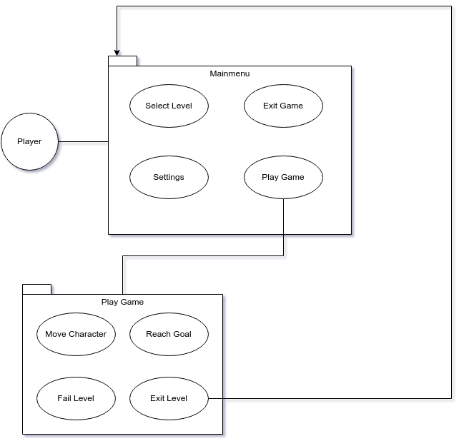

# Software Architecture Document

# Table of Contents
- [Introduction](#1-introduction)
    - [Purpose](#11-purpose)
    - [Scope](#12-scope)
    - [Definitions, Acronyms and Abbreviations](#13-definitions-acronyms-and-abbreviations)
    - [References](#14-references)
    - [Overview](#15-overview)
- [Architectural Representation](#2-architectural-representation)
- [Architectural Goals and Constraints](#3-architectural-goals-and-constraints)
- [Use-Case View](#4-use-case-view)
    - [Use-Case Realizations](#41-use-case-realizations)
- [Logical View](#5-logical-view)
    - [Overview](#51-overview)
    - [Architecturally Significant Design Packages](#52-architecturally-significant-design-packages)
- [Process View](#6-process-view)
- [Deployment View](#7-deployment-view)
- [Implementation View](#8-implementation-view)
    - [Overview](#81-overview)
    - [Layers](#82-layers)
- [Data View](#9-data-view)
- [Size and Performance](#10-size-and-performance)
- [Quality](#11-quality)

## 1. Introduction

### 1.1 Purpose
This document provides an overview of our software architecture. With several different architectural views it depicts different aspects of the system. It is intended to capture and convey the significant architectural decisions which have been made for the system.

### 1.2 Scope
This document describes the architecture of the UltimateRecipeHunter project.

### 1.3 Definitions, Acronyms and Abbreviations

| Abbrevation | Description                            |
| ----------- | -------------------------------------- |
| API         | Application programming interface      |
| MVC         | Model view controller                  |
| REST        | Representational state transfer        |
| SDK         | Software development kit               |
| SRS         | Software requirements specification    |
| UC          | Use case                               |
| VCS         | Version control system                 |
| n/a         | not applicable                         |
| tbd         | to be determined                       |

### 1.4 References

| Title                                                              		| Date       | Publishing organization   |
| --------------------------------------------------------------------------|:----------:| ------------------------- |
| [Repository on GitHub](https://github.com/Raos2806/UltimateRecipeHunter)		| 06.12.2022 | UltimateRecipeHunter Team     |
| [UC1 Play the game](./use_cases/UC1_play_the_game.md)           		| 06.12.2022 | UltimateRecipeHunter Team     |
| [UC2 Safe the game](./use_cases/UC2_safe_the_game.md)           		| 06.12.2022 | UltimateRecipeHunter Team     |
| [UC3 Leave the game](./use_cases/UC3_leave_the_game.md)     		| 06.12.2022 |UltimateRecipeHunter Team     |
| [UC4 Configure settings](./use_cases/UC4_configure_settings.md)       		| 06.12.2022 | UltimateRecipeHunter Team     |
| [UC5 Main menu](./use_cases/UC5_main_menu.md)                         		| 06.12.2022 | UltimateRecipeHunter Team     |
| [UC6 Ingame menu](./use_cases/UC6_ingame_menu.md)                            		| 06.12.2022 | UltimateRecipeHunter Team     |
| [SRS](./SoftwareRequirementsSpecification.md)                      		| 06.12.2022 | UltimateRecipeHunter Team     |

### 1.5 Overview
This document contains the architectural representation, goals and constraints as well 
as the logical, deployment, implementation and data views.

## 2. Architectural Representation

## 3. Architectural Goals and Constraints

[Architecture Significant Requirements](./ASR.md)

## 4. Use-Case View

### 4.1 Use-Case Realizations
n/a

## 5. Logical View

### 5.1 Overview
n/a
### 5.2 Architecturally Significant Design Packages
n/a
## 6. Process View

Use case realization specification 1: 
[UCRS 1](./UCRS/UCRS1.md)

Use case realization specification 2: 
[UCRS 2](./UCRS/UCRS2.md)

## 7. Deployment View
n/a

## 8. Implementation View
n/a
### 8.1 Overview
n/a
### 8.2 Layers
n/a

## 9. Data View

n/a
## 10. Size and Performance
n/a

## 11. Quality/Metrics

We thought that our game will grow significantly in the future. For example more levels or game elements.
Thats why we decided that Modifiability is our main architecture decision.
Some of our tactics are:

- Adding new levels:
Adding a new level should be easy and independent of the game.

- Changing / Adding game elements (Enemies):
Enemies shall be modified just by changing the enemy itself and not changing things in the game/level.
Adding a new enemy should be easy and independent of the game.

- Let the user work:
Adding options for the user to add custom levels, textures, etc.
So the user can add things (independent of the main game) which he likes so he has more fun playing the game. 
