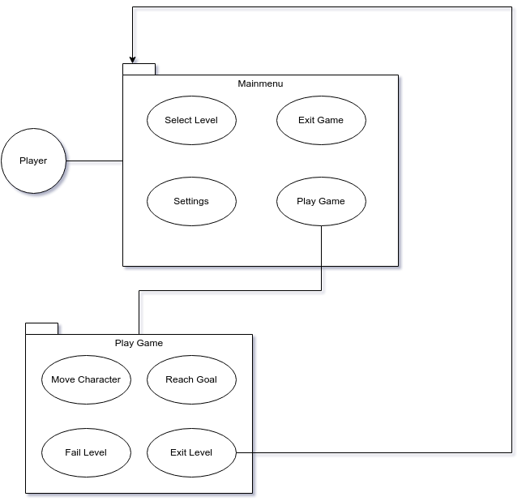

# Ultimate Recipe Hunter - Software Requirements Specification 

## Table of contents
- [Table of contents](#table-of-contents)
- [Introduction](#1-introduction)
    - [Purpose](#11-purpose)
    - [Scope](#12-scope)
    - [Definitions, Acronyms and Abbreviations](#13-definitions-acronyms-and-abbreviations)
    - [References](#14-references)
    - [Overview](#15-overview)
- [Overall Description](#2-overall-description)
    - [Vision](#21-vision)
    - [Use Case Diagram](#22-use-case-diagram)
	- [Technology Stack](#23-technology-stack)
- [Specific Requirements](#3-specific-requirements)
    - [Functionality](#31-functionality)
    - [Usability](#32-usability)
    - [Reliability](#33-reliability)
    - [Performance](#34-performance)
    - [Supportability](#35-supportability)
    - [Design Constraints](#36-design-constraints)
    - [Online User Documentation and Help System Requirements](#37-on-line-user-documentation-and-help-system-requirements)
    - [Purchased Components](#purchased-components)
    - [Interfaces](#39-interfaces)
    - [Licensing Requirements](#310-licensing-requirements)
    - [Legal, Copyright And Other Notices](#311-legal-copyright-and-other-notices)
    - [Applicable Standards](#312-applicable-standards)
- [Supporting Information](#4-supporting-information)

## 1. Introduction

### 1.1 Purpose
This Software Requirements Specification (SRS) describes all specifications for the application "Ultimate Recipe Hunter". It includes an overview about this project, detailed information about the planned features and boundary conditions of the development process.

### 1.2 Scope
The project is going to be realized as mainly an Android App but will also be usable on Windows OS.  
  
Actors of this App can be users (players).  
  
Planned Subsystems are: 
* Menu:  
Select whether you want to play, access the settings or exit the application.
* Settings:  
Configure aspects relevant to the game.
* Game:  
The game itself, where you can freely move a character through different obstacles.
* Storing Data:  
User Data will be stored locally.

### 1.3 Definitions, Acronyms and Abbreviations
| Abbrevation | Explanation                            |
| ----------- | -------------------------------------- |
| SRS         | Software Requirements Specification    |
| UC          | Use Case                               |
| n/a         | not applicable                         |
| tbd         | to be determined                       |

### 1.4 References

| Title                                                              | Date       | Publishing organization   |
| -------------------------------------------------------------------|:----------:| ------------------------- |
| [Jira](https://se-teamjump.atlassian.net/jira/software/projects/URH/boards/1)    | 25.10.2022 | URH Team    |
| [discord](https://discord.gg/CAPQvfkHyw)              | 25.10.2022 | URH Team    |

### 1.5 Overview
The following chapter provides an overview of this project with our motivation and a Use Case Diagram. The third chapter (Requirements Specification) delivers more details about the specific requirements in terms of functionality, usability and design parameters. In the end there is a chapter with supporting information. 
    
## 2. Overall Description

### 2.1 Motivation
None of the members of our team have any major programming experience yet. That is why we decided to create an Android app. To get started we want to develop a basic jump'n'run game which is also expandable.

### 2.2 Use Case Diagram

### 2.3 Technology Stack
The technology we use is:

Backend:
-Godot Engine

Frontend:
-Android

IDE:
-Godot Language

Project Management:
-Gira
-GitHub
-Discord

Deployment:
tbd

Testing:
tbd
## 3. Specific Requirements

### 3.1 Functionality
This section will explain the different use cases, you could see in the Use Case Diagram, and their functionality.  
Until December we plan to implement:
- 3.1.1 Play the game
- 3.1.2 Save the game
- 3.1.3 Quit the game
- 3.1.4 Configure settings

#### 3.1.1 Play the game
This feature is the most essential one of our project. The user can freely move his character through the levels, each containing different obstacles.

[Play the game](./use_cases/play_the_game.md)

#### 3.1.2 Save the game
Save the progress you made in the game. Will automatically happen after completing a level.

[Save the game](./use_cases/UC2_save_the_game.md)

#### 3.1.3 Leave the game
You can quit the game any time you like. Progress will only be saved up until the last completed level.

[Leave the game](./use_cases/UC3_leave_the_game.md)

#### 3.1.4 Configure settings
Change settings that directly affect the game.

[Configure settings](./use_cases/UC4_configure_settings.md)

### 3.2 Usability
We plan on designing the user interface as intuitive and self-explanatory as possible to make the user feel as comfortable as possible using the app. There will be a tutorial to learn the basics of the game.

#### 3.2.1 Interface
A quick tutorial will introduce the user to the basic principles of the game. 

#### 3.2.2 Intuitive gameplay
The gameplay is intuitive and therefore easy to understand by most people. 

### 3.3 Reliability

#### 3.3.1 Control
Reliable control of the character ensures uninterrupted gameplay. 

#### 3.3.2 Defect Rate and Bugs
We will try to keep bugs to a minimum and fix them as soon as we find any.

### 3.4 Perfomance

#### 3.4.1 Gameplay
The App will run smoothly to ensure a high quality of gameplay. 

#### 3.4.2 Response time
The App will respond in as little time as possible to ensure a high quality of gameplay. 

### 3.5 Supportability

#### 3.5.1 Coding Standards
We are going to write the code by using all of the most common clean code standards. For example we will name our variables and methods by their functionalities. This will keep the code easy to read by everyone and make further developement much easier. 

### 3.6 Design Constraints
To ensure good readability and focus on the gameplay itself we will try to keep the design as minimalistic as possible. We will use Godot engine and the Godot programming language to run the game. 

### 3.7 On-line User Documentation and Help System Requirements
The game will have a repeatable tutorial to teach the basic aspects of the game. Elements that are added at a latter point in the game will be explained once they appear. There will be a formular to contact the development team. 

### 3.8 Purchased Components
There are no purchased components so far. 

### 3.9 Interfaces

#### 3.9.1 User Interfaces
The User interfaces that will be implented are:
- Menu - Select whether you want to play or access the settings. 
- Settings: Configure aspects relevant to the game. 
- Game: Move freely in the game. 

#### 3.9.2 Hardware Interfaces
(n/a)

#### 3.9.3 Software Interfaces
The app will be runnable on Android and Windows OS.

#### 3.9.4 Communication Interfaces
(n/a)

### 3.10 Licensing Requirements
(n/a)
### 3.11 Legal, Copyright, and Other Notices
(n/a)

### 3.12 Applicable Standards
The development will follow the common clean code standards and naming conventions. 

## 4. Supporting Information
For any further information you can contact the Ultimate Recipe Hunter Team.
The Team Members are:
- Felix Steinhauser
- Timo Huter
- Miko Heuken
