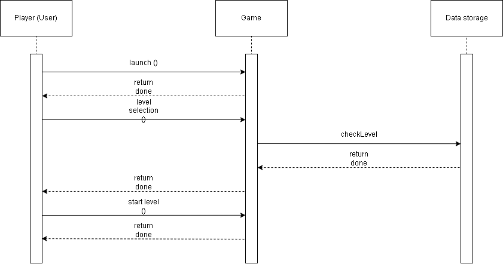

# Use-Case-Realization Specification 1: Selecting a level to play

## Table of contents
- [Table of contents](#table-of-contents)
- [Introduction](#1-introduction)
  - [Purpose](#11-purpose)
  - [Scope](#12-scope)
  - [Definitions, Acronyms and Abbreviations](#13-definitions,_acronyms_and_abbreviations)
  - [References](#14-references)
- [Flow of Events - Design](#2-flow_of_events_-_design)

## 1. Introduction

### 1.1 Purpose

This Use-Case-Realization Specification describes the implementation of selecting a level to play.

### 1.2 Scope

The use-cases of this document are influenced by the UML guidelines.

### 1.3 Definitions, Acronyms and Abbreviations
| Abbrevation | Explanation                            |
| ----------- | -------------------------------------- |
| SRS         | Software Requirements Specification    |
| UC          | Use Case                               |
| n/a         | not applicable                         |
| tbd         | to be determined                       |

### 1.4 References

n/a

## 2. Flow of Events - Design

As seen in the above sequence diagram, the first step is to launch the application on your device.
The main menu screen will contain buttons to navigate through the app. By tapping the play button, the user will be able to enter the level selection.
At this point, the application will check the data storage to make only the previously unlocked levels available to play. By tapping an eligible level, the user can start playing said level.
