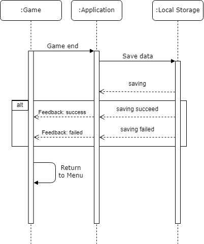

# Use-Case-Realization Specification 2: Exiting the game

## Table of contents
- [Table of contents](#table-of-contents)
- [Introduction](#1-introduction)
  - [Purpose](#11-purpose)
  - [Scope](#12-scope)
  - [Definitions, Acronyms and Abbreviations](#13-definitions-acronyms-and-abbreviations)
  - [References](#14-references)
- [Flow of Events](#2-flow-of-events)

## 1. Introduction

### 1.1 Purpose

This Use-Case-Realization Specification describes the implementation after the game has ended.

### 1.2 Scope

The use-cases of this document are influenced by the UML guidelines.

### 1.3 Definitions, Acronyms and Abbreviations
| Abbrevation | Explanation                            |
| ----------- | -------------------------------------- |
| SRS         | Software Requirements Specification    |
| UC          | Use Case                               |
| n/a         | not applicable                         |
| tbd         | to be determined                       |

### 1.4 References

n/a

## 2. Flow of Events

The above sequence diagram shows what happens after the game has ended.
The game ends by either succeeding or failing the level that has been selected. This will save the game automatically.
At this point the application will check the data storage to save the current progress of the user. The application will then show a message that tells the User whether the progress could be saved.
