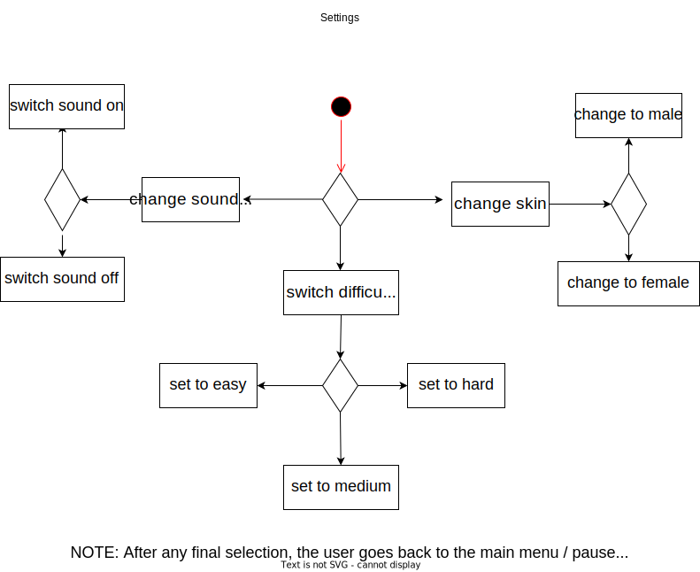

# Use-Case Specification: Configure the Settings

# 1. Configure the Settings

## 1.1 Brief Description
This use case is about changing the settings of the game. Here is a list of the settings the user is going to be able to change:
- Music volume
- language
- 'for further questions, contact Team URH'
## 1.2 Mockup 
tbd

## 1.3 Screenshots
tbd

# 2. Flow of Events

## 2.1 Basic Flow
- User opens settings
- User is able to change settings

### Activity Diagram

## 2.2 Alternative Flows
n/a

# 3. Special Requirements
n/a

# 4. Preconditions
The preconditions for this use case are:
1. The user has started the App

# 5. Postconditions
Settings will be adjusted to the users wishes.

# 6. Effort

Effort: Low
Doesn't require a lot of effort.
